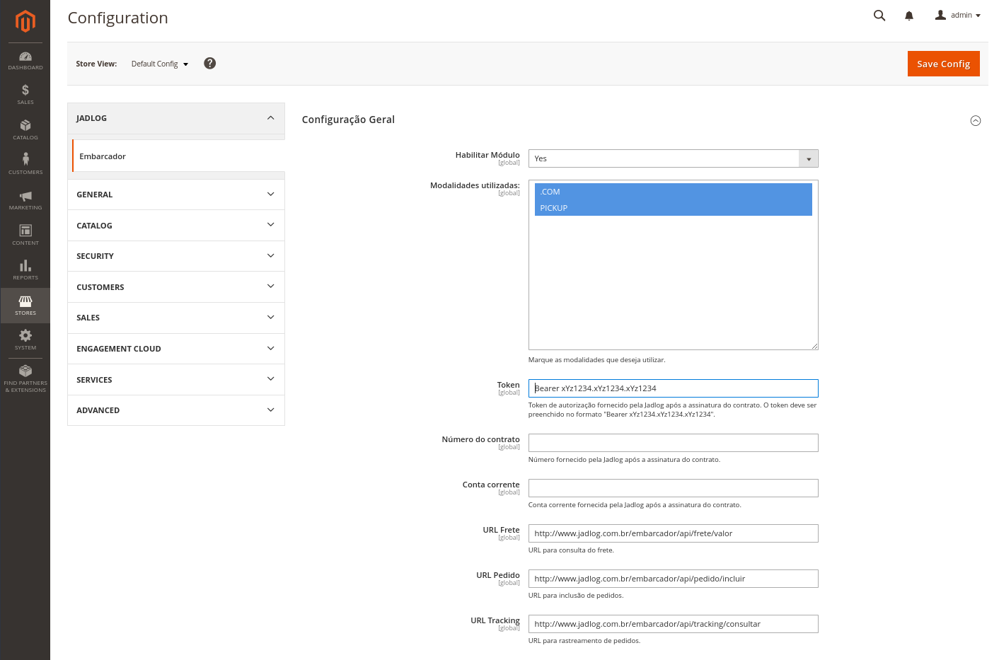
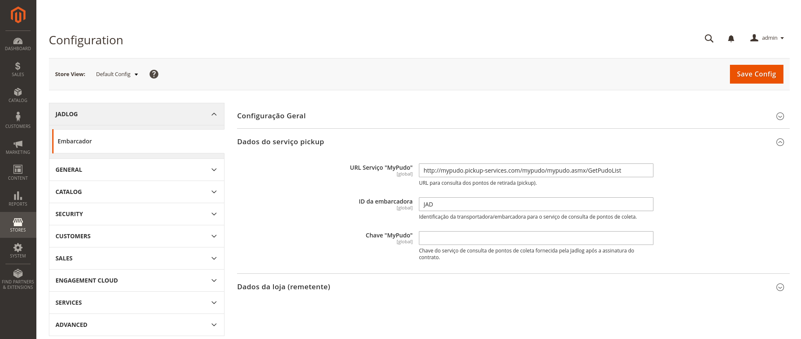
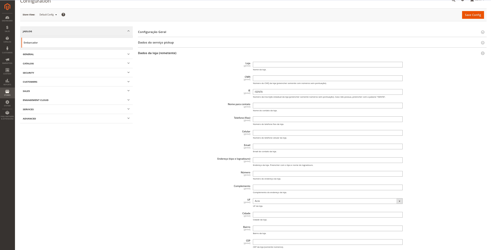
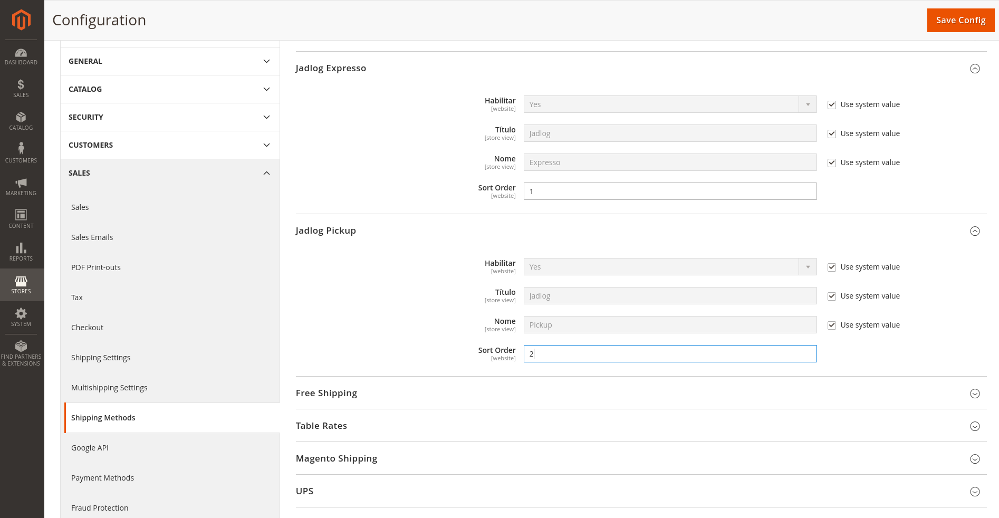

[//]: # (To view this file use: python -m pip install --user grip; python -m grip -b "Jadlog - Magento.md")
[//]: # (https://github.com/settings/tokens)
[//]: # (vim ~/.grip/settings.py)
[//]: # (PASSWORD = 'YOUR-ACCESS-TOKEN')
[//]: # (https://github.com/naokazuterada/MarkdownTOC)
[//]: # (Many thanks to peek for animated gif generation: https://github.com/phw/peek)

# Módulo de Frete Jadlog - Magento 2.3

!!! _**Versão BETA**_ !!!


## Conteúdo
<!-- MarkdownTOC -->

- [Introdução](#introducao)
  - [Compatibilidade](#compatibilidade)
  - [Arquivos e documentos necessários](#arquivos-e-documentos-necessarios)
  - [Avisos importantes](#avisos-importantes)
- [Instalação](#instalacao)
- [Configuração](#configuracao)
  - [Parâmetros iniciais](#parametros-iniciais)
    - [Configuração Geral](#configuracao-geral)
    - [Dados do serviço pickup](#dados-do-servico-pickup)
    - [Dados da loja \(remetente\)](#dados-da-loja-remetente)
  - [Nota sobre cubagem](#nota-sobre-cubagem)
  - [Forma de entrega](#forma-de-entrega)
- [Utilização pelos clientes](#utilizacao-pelos-clientes)
  - [Escolha do ponto de retirada](#escolha-do-ponto-de-retirada)
  - [Rastreamento](#rastreamento)
- [Utilização pelo administrador da loja](#utilizacao-pelo-administrador-da-loja)
  - [Preencher dados fiscais](#preencher-dados-fiscais)
  - [Enviar solicitação de coleta](#enviar-solicitacao-de-coleta)
- [Desenvolvimento](#desenvolvimento)

<!-- /MarkdownTOC -->


<a id="introducao"></a>
## Introdução

Este documento auxilia a instalação, configuração e utilização do módulo de entrega Jadlog em sua plataforma e-commerce Magento.

<a id="compatibilidade"></a>
### Compatibilidade

- Magento versão 2.3.x.
- PHP 7.2.

<a id="arquivos-e-documentos-necessarios"></a>
### Arquivos e documentos necessários
Após o aceite da Proposta Comercial, serão fornecidos:
- Contrato Jadlog
- Documento técnico de acessos para configurações
- Este manual de instalação e utilização

<a id="avisos-importantes"></a>
### Avisos importantes
* Deve-se testar o módulo em um ambiente de homologação antes de colocá-lo em produção.
* Faça backup do sistema regularmente - especialmente antes de instalar um novo módulo.

***A Jadlog não se responsabiliza por eventuais perdas de dados.***

<a id="instalacao"></a>
## Instalação
Certifique-se que o software Magento está instalado em local seguro em seu computador/servidor.

Por tratar-se de versão **BETA** a instalação deve ser feita copiando o código fonte diretamente no servidor.

*O passo a passo a seguir supõe que o Magento esteja instalado em **/var/www/html***:

1. Clone esse repositório diretamente no seu servidor numa pasta apropriada, por exemplo:
```bash
mkdir /var/www/html/jadlog
cd /var/www/html/jadlog
git clone https://github.com/Jadlog/magento-2.3.git
```

2. Configure o repositório local:
```bash
cd /var/www/html
composer require magento/magento-composer-installer
composer config repositories.jadlog-embarcador path /var/www/html/jadlog/magento-2.3/src/app/code/Jadlog/Embarcador
```

3. Habilite o módulo:
```bash
cd /var/www/html/
composer require jadlog/embarcador
php bin/magento module:status
php bin/magento module:enable Jadlog_Embarcador
php bin/magento setup:di:compile
php bin/magento setup:upgrade

```

<a id="configuracao"></a>
## Configuração

<a id="parametros-iniciais"></a>
### Parâmetros iniciais
Para configurar os parâmetros iniciais do módulo acesse a configuração a partir do menu *Stores -> Configuration*, submenu *Jadlog -> Embarcador*.
Há três seções distintas.
- Configuração Geral
- Dados do serviço pickup
- Dados da loja (remetente)

<a id="configuracao-geral"></a>
#### Configuração Geral



- **Habilitar módulo**:  
Yes (Sim).

- **Modalidades utilizadas**:  
Marcar as modalidades de entrega contratadas. Utilize a tecla *Control* para marcar múltiplas modalidades. Para maiores informações consulte <?>.

- **Token**:  
Token de autorização fornecido pela Jadlog após a assinatura do contrato  
O token deve ser preenchido no formato *Bearer xYz1234.xYz1234.xYz1234*. É importante manter a palavra *Bearer* seguida por *espaço* e a sequência correta de caracteres.

- **Número do contrato**:  
Número de contrato fornecido pela Jadlog após a assinatura do contrato.

- **Conta corrente**:  
Conta corrente fornecida pela Jadlog após a assinatura do contrato.

- **URL Frete**:  
Endereço para cotação do frete.  
Valor padrão: *http://www.jadlog.com.br/embarcador/api/frete/valor*

- **URL Pedido**:  
Endereço para envio do pedido de coleta.  
Valor padrão: *http://www.jadlog.com.br/embarcador/api/pedido/incluir*

- **URL Tracking**:  
Endereço para rastreamento do pedido.  
Valor padrão: *http://www.jadlog.com.br/embarcador/api/tracking/consultar*

<a id="dados-do-servico-pickup"></a>
#### Dados do serviço pickup



- **URL Serviço "MyPudo"**:  
Endereço para consulta dos pontos de retirada (pickup).  
Valor padrão: *http://mypudo.pickup-services.com/mypudo/mypudo.asmx/GetPudoList*

- **ID da embarcadora**:  
Identificação da transportadora/embarcadora para o serviço de consulta de pontos de coleta.  
Valor padrão: *JAD*

- **Chave "MyPudo"**:  
Chave do serviço de consulta de pontos de coleta fornecida pela Jadlog após a assinatura do contrato.

<a id="dados-da-loja-remetente"></a>
#### Dados da loja (remetente)



- **Loja**:  
Nome da loja.

- **CNPJ**:  
Preencher com o CNPJ da loja (somente números sem pontuação).

- **IE**:  
Número da inscrição estadual da loja. Preencher somente com números ou, caso não possua, preencher com a palavra *ISENTA*.

- **Nome para contato**:  
Nome do contato da loja.

- **Telefone (fixo)**:  
Número do telefone fixo da loja.

- **Celular**:  
Número do telefone celular da loja.

- **Email**:  
Email do contato da loja.

- **Endereço (tipo e logradouro)**:  
Endereço da loja. Preencher com o tipo e nome do logradouro.

- **Número**:  
Número do endereço da loja.

- **Complemento**:  
Complemento do endereço da loja.

- **UF**:  
UF da loja (informar a sigla com dois caracteres).

- **Cidade**:  
Cidade da loja.

- **Bairro**:  
Bairro da loja.

- **CEP**:  
CEP da loja (somente números).


<a id="nota-sobre-cubagem"></a>
### Nota sobre cubagem
Todos os produtos devem ser cadastrados incluindo o peso a ser taxado. Se o peso cubado do produto for maior que o peso em kg, favor informar o peso cubado. O módulo não irá calcular o peso cubado.


<a id="forma-de-entrega"></a>
### Forma de entrega
Para habilitar a escolha de frete Jadlog o último passo é ativar a forma de entrega. Para isso, deve-se acessar *Stores -> Configuration*, submenu *Sales -> Shipping Methods*. 



Deve-se escolher "Habilitar - Yes" para as formas de entrega "Jadlog Expresso" e "Jadlog Pickup" (o padrão é vir habilitado). No campo "Sort Order" pode-se definir a ordem em as formas de entrega vão aparecer. Após configurar clique em *Save Config* para gravar.


<a id="utilizacao-pelos-clientes"></a>
## Utilização pelos clientes

<a id="escolha-do-ponto-de-retirada"></a>
### Escolha do ponto de retirada
Caso o cliente escolha como forma de entrega a modalidade "Jadlog - Retire em um ponto Pickup" ele terá a oportunidade de escolher um ponto de retirada próximo ao endereço que ele preencheu no cadastro.

<a id="rastreamento"></a>
### Rastreamento
*No momento deve ser feito diretamente pelo site da Jadlog.*

<a id="utilizacao-pelo-administrador-da-loja"></a>
## Utilização pelo administrador da loja

<a id="preencher-dados-fiscais"></a>
### Preencher dados fiscais

<a id="enviar-solicitacao-de-coleta"></a>
### Enviar solicitação de coleta

<a id="desenvolvimento"></a>
## Desenvolvimento

* [Jadlog](http://www.jadlog.com.br) - *Uma empresa DPDgroup*
